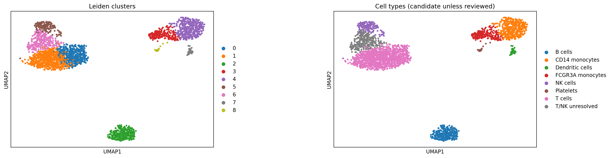
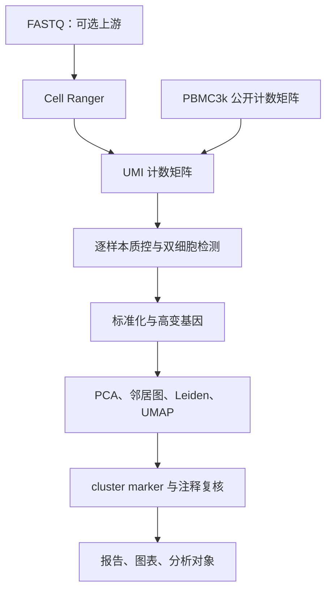

# scRNA-seq Learning Pipeline

一个可以运行、逐步学习并检查结果的中文单细胞 RNA 测序教学仓库。

[](https://github.com/flee70973-coder/F/actions/workflows/ci.yml)

项目托管在 [flee70973-coder/F](https://github.com/flee70973-coder/F)。第一次使用 GitHub，可直接点击绿色 **Code → Download ZIP** 下载项目，解压后从下面的学习顺序开始。

**主线：Python 3.12 + Scanpy 1.11.5 + Snakemake 9.26.1；演示数据：10x PBMC3k。**

仓库附带已核验的 PBMC3k 原始 UMI 计数和 Reactome 基因集快照。首次安装依赖需要网络；默认数据分析可以离线运行。

## 快速开始

使用 Git 下载时运行 `git clone https://github.com/flee70973-coder/F.git scrna-seq-learning`，然后进入 `scrna-seq-learning` 目录。

解压项目或 clone 仓库后，进入项目根目录。先安装 [uv](https://docs.astral.sh/uv/getting-started/installation/)，再运行：

```bash
uv sync --locked --group tutorial
uv run snakemake --cores 2 --dry-run
uv run snakemake --cores 2
```

运行结束后打开 `results/pbmc3k/report.html`，最终分析对象是
`results/pbmc3k/objects/06_annotated.h5ad`。
遇到问题时见 [环境与故障排查](docs/00_setup.md)。Linux/macOS 可使用，Windows 推荐 WSL2 Ubuntu；本次实际验证环境为 Linux。

## 学习顺序

| 顺序 | 内容 | 文档 |
|---|---|---|
| 1 | 环境、运行命令、输出文件 | [安装与排错](docs/00_setup.md) |
| 2 | 数据来源、UMI、细胞与样本的区别 | [数据说明](docs/01_dataset.md) |
| 3 | 从输入到 QC、降维、聚类 | [逐步分析教程](docs/02_walkthrough.md) |
| 4 | marker、候选标签、人工复核 | [细胞注释](docs/03_annotation.md) |
| 5 | 真实多样本、Harmony、pseudobulk、GMT 富集 | [进阶分析](docs/04_multisample.md) |
| 6 | FASTQ → Cell Ranger → 本流程 | [上游处理](docs/05_fastq.md) |
| 7 | 创建 GitHub 仓库、协作和自动检查 | [发布到 GitHub](docs/06_github.md) |
| 8 | 对照 R/Seurat 理解相同分析概念 | [Seurat 对照表](docs/07_seurat_mapping.md) |

逐步运行的中文 Notebook：`notebooks/01_pbmc3k_walkthrough.ipynb`。
已有真实运行结果见 `examples/pbmc3k/`；验证范围与软件版本见 `VALIDATION.md`。



本次参数下保留 2,607 个细胞、13,611 个基因，得到 9 个 Leiden clusters。
标签基于 marker 提供候选解释；完整证据和未解决的 T/NK 群见示例报告。

## 工作流



主线完整运行计数矩阵到报告。FASTQ 上游需要另装 Cell Ranger、匹配的参考基因组和真实 FASTQ，
本仓库提供可执行入口，但 PBMC3k 演示采用官方已生成的计数，不重新比对旧化学版本的 FASTQ。
多样本整合、样本级差异分析、功能富集提供可运行入口；默认单供者数据不会伪造组别或批次。

## 常用命令

```bash
# 顺序执行所有步骤；适合阅读日志或调试
uv run scrna-learn run --config config/config.yaml
# 只执行一个阶段；前一阶段输出需已存在
uv run scrna-learn stage qc --config config/config.yaml
# 打开逐步教学 Notebook
uv run --group tutorial jupyter lab notebooks/01_pbmc3k_walkthrough.ipynb
# 验证代码、统计边界与离线流程
uv run pytest -q
```

配置集中在 `config/config.yaml`。输入和输出路径相对于仓库根目录。
修改参数后重新执行 Snakemake，受影响步骤会重算；保留中间对象便于追溯。

## 仓库内容

| 路径 | 用途 |
|---|---|
| `src/scrna_learn/` | 分析实现与命令行入口 |
| `Snakefile` | 分阶段依赖、日志与资源管理 |
| `config/` | 参数、样本表、marker 面板 |
| `profiles/default/` | 自动加载的 SQLite 工作流状态配置 |
| `resources/` | 原始教学计数、基因集快照和数据授权来源 |
| `docs/` | 中文教程、设计边界和参考来源 |
| `notebooks/` | 能逐格执行的教学 Notebook |
| `examples/pbmc3k/` | 实测报告、图表、关键统计 |
| `tests/` | 原始计数、聚合、富集与离线流程检查 |
| `.github/workflows/` | PR 离线检查及手动真实数据运行 |
| `uv.lock` | 含传递依赖和包校验信息的环境锁文件 |

7.4 MiB 的公共教学计数随仓库分发；个人项目的原始大文件、运行缓存和完整本地结果不进入 Git。代码采用 MIT；PBMC3k 数据及衍生结果遵循原数据的 CC BY 4.0，见 [数据来源](docs/01_dataset.md)。

这是教学和研究探索流程。自动标签是候选注释；cluster marker 的 p 值来自探索性细胞级比较，不能替代有独立生物学重复的疾病差异分析。
